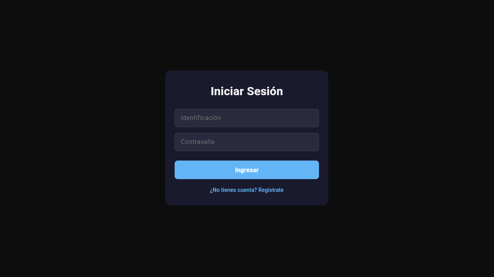
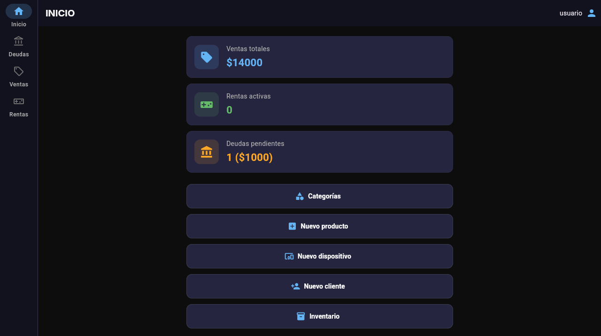
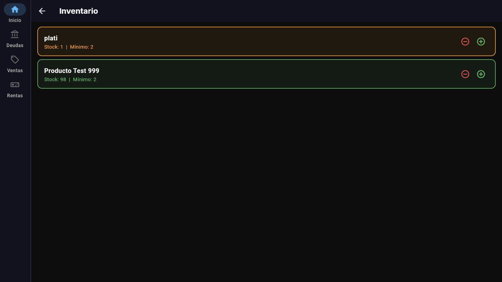
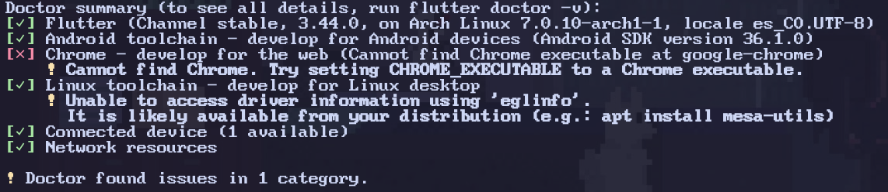

# Proyecto Venta Renta


## Tabla de Contenido

- Caracteristicas
- Arquitectura
- Tecnologias
- Instalacion
- Variables de entorno
- Base de datos
- Api
- CI/CD

## Introduccion

Este es un repositorio monolitico(tiene backend y frontend juntos) usando una estructura de carpetas modular.

login



inicio



inventario



## Instalar proyecto 

hacer un git clone del proyecto y movernos hacia la carpeta:

```bash
git clone https://github.com/ProgremBeta/ventaRenta
cd ventaRenta
```

### -------------------------------------------------- levantar el backend --------------------------------------------------

Estando en la raiz del proyecto navegar hasta el backend:

```bash
cd backend
```

En necesario que tenga instalado Node JS https://nodejs.org/en y "pnpm", en windows al instalar desde la pagina oficial viene incluido el npm con el node js. o podemos ejecutar los siguientes comandos para instalar pnpm.

#### En Windows (PowerShell)

```bash
iwr https://pnpm.io -useb | iex
```

#### En macOS (Terminal)

```bash
brew install pnpm
```

o

```bash
curl -fsSL https://pnpm.io | sh -
```

#### En Linux (Terminal)

```bash
curl -fsSL https://pnpm.io | sh -
```

para verificar la instalacion ejecutar el siguiente comando:

```bash
node -v
pnpm -v
```

En algunas distribuciones de linux se tiene que instalar el npm aparte, tendrian que buscarlo en su gestor de paquete he instalarlo, en mi caso uso arch entonces los comandos serian:

```bash
sudo pacman -S nodejs
sudo pacman -S pnpm
```

### -------------------------------------------------- levantar el frontend --------------------------------------------------

Estando en la raiz del proyecto navegar hasta el frontend:

```bash
cd frontend
```

el bashfrontend esta desarrollado en flutter entonces necesitaremos tenerlo instalado y configurado.

> [bash!NOTE]
>
> Depende del sistema operativo al instalar el flutter todo viene integrado y otros es necesario instarlar estos paquetes manualmente.

* instalar flutter https://docs.flutter.dev/install 
* instalar cmake https://cmake.org/download/
* instalar ninja https://pub.dev/packages/ninja/versions

ya teniendo todos los paquetes de flutter tambien se puden comprobar que este correcto con el comando:

```bash
flutter doctor
```

flutter me permite desarrollar para multiplataforma entonces puedo ejecutarlo en android, ios, windows, macOS, linux, web y embebidos

el resultado sera algo similar a esto, en mi caso, linux y android
bash


para usar android tienen que instalar android studio y intalar "cmd-tools"


### -------------------------------------------------- base de datos --------------------------------------------------
> [bash!NOTE]
>
> primero es necesario hacer la instacion de los paquetes o tener prisma. Esta en el apartado de configuracion y ejecucion

La base de datos que use fue POSTGRESQL con prisma, para este caso sugiero usar el comando para dev, hay 2 diferiencias entre el dev y el de deploy.

1. dev: crea la estructura y ejecuta datos que el desarollador quiera que vean(en mi caso solo la estructura)

```bash
pnpm prisma migrate dev
```

2. deploy: esta se usa si NO queremos afectar datos existentes, entonces al levantar el proyecto no deberia existir datos.

```bash
pnpm prisma migrate dev
```

### .env

para el correcto funcionamiento del proyecto es necesario ingresar correctamente las variables de entorno.

aqui se vera un ejemplo de los datos requerido para las variables de entorno.

```bash
cd backend/.env.ejemplo
```

## configuracion y ejecucion

estamos en la etapa final para levantar el proyecto completamente.

### backend

iniciemos por el backend, instalando los paquetes.

```bash
pnpm i
```

con los paquetes instalados podemos ejecutar el proyecto.

```bash
pnpm start
```

## configuracion y ejecucion
### frontend

bien estamos en la etapa final para levantar el proyecto.

### backend
iniciemos por el backend, instalando los paquetes.

```bash
pnpm i
```

con los paquetes instalados podemos ejecutar el proyecto.

```bash
pnpm start
```

### frontend

para instalar las dependencias usamos:

```bash
flutter pub get
```

tambien podemos verificar el dispositivo usando

```bash
flutter devices
```
y finalmente ejecutarlo

```bash
flutter run
```

## Estado

🚧 En desarrollo activo

## Autor

Juan Ignacio Betancur (progremb)